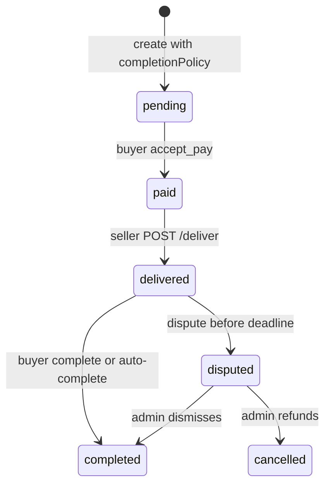

`completionPolicy` is **post-delivery** buyer protection for marketplace digital goods (codes, game currency, licenses, accounts). It is distinct from [`fulfillmentPolicy`](/guides/quick-escrow-with-proof) (pre-delivery purchase proof) and from [`progressiveRelease`](/guides/progressive-release) (hourly slice payouts).

Send it on [Create Escrow](/api-reference/escrows/create-escrow) **instead of** `completionDeadlineDays` when the seller **must** mark delivered before the buyer can release funds.

## How it differs from a normal escrow

A normal quick/standard escrow lets the buyer `complete` from `paid` without a deliver step (`buyer_early_release`). With `completionPolicy.type: "delivery_confirmation"`:

- the buyer cannot release from `paid` (`DELIVERY_REQUIRED`)
- the seller calls [Deliver Escrow](/api-reference/escrows/deliver-escrow)
- `completionDeadline` is `deliveredAt + buyerReviewDeadlineHours × 3600000` (exact hours, not calendar days)
- the buyer may accept immediately or open a dispute **before** that deadline
- if they stay silent, DHMAD auto-completes and releases funds
- there is no `autoComplete` flag — silence always releases

## Attributes (`POST /v1/escrows`)

| Field | Required | Description |
| --- | --- | --- |
| `completionPolicy` | No | Presence opts in. Cannot be combined with `completionDeadlineDays` or `progressiveRelease` (`400`). |
| `completionPolicy.type` | Yes, when the object is sent | Only `"delivery_confirmation"`. Unknown keys (including `autoComplete`) are rejected (`400`). |
| `completionPolicy.buyerReviewDeadlineHours` | No | Whole hours after deliver. Live platform bounds default **24–336**. Omit to freeze the platform default (usually **168**). The resolved number is stored on the escrow at creation. Hard schema cap is 2160. |

Works with `mode: "quick"` or `mode: "standard"`. Can be combined with `fulfillmentPolicy.type: "purchase_proof_required"` (proof first, then deliver, then this window). `buyerReviewDeadlineHours` on `completionPolicy` is the **post-delivery** protection window. The same field name on `fulfillmentPolicy` remains the pre-delivery proof-review timeout.

<Info>
  In the [API Explorer](https://developer.dhmad.tn/dashboard/api-explorer), expand **POST /v1/escrows** and select the **Quick mode with delivery confirmation** request example.
</Info>

## Create example

Never expose your API key in the browser. From your backend:

```javascript
const res = await fetch("https://sandbox.dhmad.tn/api/v1/escrows", {
  method: "POST",
  headers: {
    Authorization: `Bearer ${process.env.DHMAD_API_KEY}`,
    "Content-Type": "application/json",
  },
  body: JSON.stringify({
    title: "Game currency pack",
    amount: 80,
    currency: "TND",
    buyerEmail: "buyer@example.com",
    sellerEmail: "seller@example.com",
    mode: "quick",
    feeBearer: "seller",
    completionPolicy: {
      type: "delivery_confirmation",
      buyerReviewDeadlineHours: 72,
    },
  }),
});
const { escrow } = await res.json();
```

## Fields echoed on GET

[Create Escrow](/api-reference/escrows/create-escrow) `201` and [Get Escrow](/api-reference/escrows/get-escrow) return:

| Field | When | Meaning |
| --- | --- | --- |
| `completionPolicy.type` | Policy was set | Always `delivery_confirmation` |
| `completionPolicy.buyerReviewDeadlineHours` | Policy was set | Frozen hours (never changes if you later change SiteConfig) |
| `completionDeadlineDays` | Classic day window only | Omitted when `completionPolicy` is set |
| `deliveredAt` | After deliver | Start of the protection window |
| `completionDeadline` | After deliver | Absolute cutoff for accept / new disputes |

Hosted checkout shows the frozen hours to the buyer **before funding**.

## Lifecycle



<Steps>
  <Step title="Create">
    Freeze hours on [Create Escrow](/api-reference/escrows/create-escrow). Do not send `completionDeadlineDays`.
  </Step>
  <Step title="Fund">
    Send the buyer to an `accept_pay` [checkout session](/api-reference/checkout-sessions/create-session). Status becomes `paid`.
  </Step>
  <Step title="Deliver">
    Seller calls [POST /escrows/:id/deliver](/api-reference/escrows/deliver-escrow). Sets `deliveredAt` and `completionDeadline`. If you also use purchase proof, deliver stays blocked until proof is accepted (`409 PROOF_NOT_ACCEPTED`).
  </Step>
  <Step title="Release or dispute">
    Buyer `complete` checkout session, or `dispute` before `completionDeadline`.
  </Step>
  <Step title="Silence">
    Hourly job auto-completes at the stored deadline. The deadline itself is authoritative: a late dispute is rejected even if cron has not run yet.
  </Step>
</Steps>

## Error codes

| Code | HTTP | When |
| --- | --- | --- |
| (validation) | `400` | Unknown `type`, extra keys, hours outside schema/live bounds, or combined with `completionDeadlineDays` / `progressiveRelease` |
| `DELIVERY_REQUIRED` | `400` on `POST /v1/escrows/{id}/sessions` (`action: complete`); `409` on buyer complete / step-up | Escrow is still `paid` |
| `DISPUTE_WINDOW_CLOSED` | `400` on `dispute` session create; `409` on open-dispute | New dispute after `completionDeadline` |
| `PROOF_NOT_ACCEPTED` | `409` | Combined with purchase proof; deliver or early complete before proof is accepted |

A dispute opened **before** the deadline still pauses auto-complete.

## Typical marketplace pattern

1. `POST /v1/escrows` with `completionPolicy`.
2. `accept_pay` → buyer pays.
3. Your app delivers the digital good; seller (or your backend acting as seller) calls `POST /deliver`.
4. Buyer `complete` when satisfied, or `dispute` if the code/account is bad.
5. Listen for `escrow.completed` (or dispute webhooks). Poll [Get Escrow](/api-reference/escrows/get-escrow) if you need to confirm after redirect.

<Warning>
  Do not send the buyer a `complete` session while status is `paid` — it returns `DELIVERY_REQUIRED`. Create that session after deliver.
</Warning>
