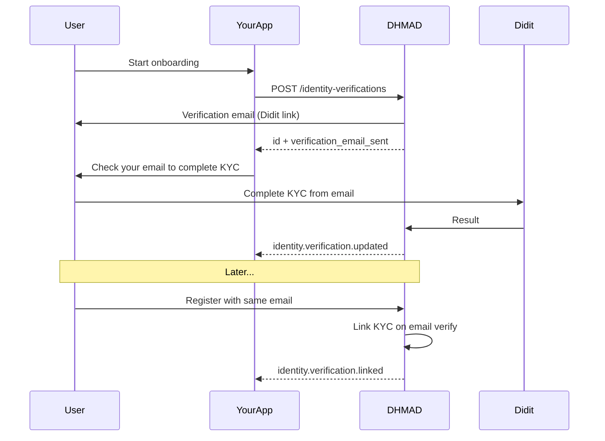

Use the **Identity Verifications API** when your marketplace or app needs users identity-verified **before** they sign up on [dhmad.tn](https://dhmad.tn). DHMAD runs Didit KYC, stores the result as a pre-account record, and links it automatically when the user later registers with the **same email**.

<Info>
  This is separate from reading `kyc_verified` on [OAuth userinfo](/api-reference/oauth/userinfo). Userinfo tells you whether an **existing** DHMAD user is verified. Identity Verifications let you **start** verification for users who do not have an account yet.
</Info>

## When to use this

- Sellers must be verified before listing, but many do not have a DHMAD account yet
- You want KYC done once in your onboarding, then honored on DHMAD for payouts and escrows
- You need webhook notifications when verification completes or when the user joins DHMAD

## How it works

1. Your **backend** calls `POST /api/v1/identity-verifications` with the user's email.
2. DHMAD sends a **verification email** to that address with a Didit link. The Didit URL is **never returned** to your API.
3. The user completes Didit from the email. DHMAD stores the result.
4. When the user later registers on DHMAD with the **same email** and verifies their email (OTP), approved KYC is linked to their account.
5. You receive webhooks at each step; OAuth `userinfo` exposes `kyc_verified: true` after linking.



## Prerequisites

- Approved developer account and API key (`sk_sandbox_*` or `sk_live_*`)
- **Allowed redirect URLs** in the [Developer Dashboard](https://developer.dhmad.tn/dashboard/settings) if you pass `redirect_url`
- Webhook endpoint subscribed to `identity.verification.updated` and `identity.verification.linked` (recommended)

<Warning>
  Never call the Identity Verifications API from the browser. Your API key must stay on your server.
</Warning>

## Step 1: Collect the user's email

During onboarding, collect the email the user will use on DHMAD later. The addresses **must match** for KYC to link when they register.

## Step 2: Create a verification session

From your backend:

```javascript
const res = await fetch("https://sandbox.dhmad.tn/api/v1/identity-verifications", {
  method: "POST",
  headers: {
    Authorization: `Bearer ${process.env.DHMAD_API_KEY}`,
    "Content-Type": "application/json",
  },
  body: JSON.stringify({
    email: seller.email,
    external_user_id: seller.id,
    redirect_url: "https://yourmarketplace.com/onboarding/kyc-done",
    metadata: { source: "seller_onboarding" },
  }),
});

const data = await res.json();
await db.sellers.update(seller.id, { dhmadVerificationId: data.id });

if (data.verification_email_sent) {
  showMessage(`We sent a verification email to ${seller.email}`);
} else {
  showMessage(data.message);
}
```

<Warning>
  DHMAD emails the Didit link directly to the user. Your API response does **not** include `verification_url`. Tell the user to check their inbox (and spam folder).
</Warning>

If you call create again for the same developer + email while a session is still **pending**, DHMAD returns the existing session and may **resend** the invite email (subject to a short cooldown).

See [Create verification](/api-reference/identity-verifications/create-verification) for full request and response fields.

## Step 3: User completes KYC from email

The user opens the DHMAD email and completes Didit. If you passed `redirect_url`, they are sent to your URL after verification completes. That URL must be listed under **allowed redirect URLs** in developer settings — same rule as [checkout sessions](/guides/checkout-sessions).

## Step 4: Handle webhooks

Subscribe to both events in the [Developer Dashboard](https://developer.dhmad.tn/dashboard/webhooks) or via the [Webhooks API](/api-reference/webhooks):

```javascript
if (event.type === "identity.verification.updated") {
  if (event.data.kyc_status === "approved") {
    await markUserVerified(event.data.external_user_id);
  }
}

if (event.type === "identity.verification.linked") {
  await db.users.update(event.data.external_user_id, {
    dhmadUserId: event.data.linked_user_id,
  });
}
```

Prefer webhooks over polling. Use `GET /identity-verifications/:id` only as a fallback.

See the [Webhooks guide](/guides/webhooks#identity-verification-events) for payload examples.

## Step 5: User joins DHMAD

When the user registers on dhmad.tn with the same email and completes email verification, DHMAD attaches the approved KYC to their account. They can request payouts and accept escrows without repeating Didit.

## Sandbox vs production

<Warning>
  On **sandbox** (`sandbox.dhmad.tn` with `sk_sandbox_*` keys), new verifications are **auto-approved immediately** — no Didit flow and **no invite email**. A webhook is emitted with `status_source: "sandbox"`. Test the full Didit + email flow on **production** before going live.
</Warning>

## Admin review

If Didit returns an ambiguous or pending result, DHMAD admins review the case. **No webhook** is sent until they approve or reject. When approved, you receive `identity.verification.updated` with `status_source: "admin_review"`.

## Tips

| Situation | What to do |
|-----------|------------|
| `409` with `user_exists: true` | Email already has approved KYC on DHMAD — skip verification |
| `verification_email_sent: false` | Retry `POST /identity-verifications` with the same email while status is pending |
| User did not receive email | Check spam; confirm email matches their future DHMAD account |
| Need status in dashboard | View sessions in [Developer Dashboard → Identity verifications](https://developer.dhmad.tn/dashboard/kyc) |

## Compliance

- Tell users that identity verification is performed by DHMAD via Didit and that they will receive an email from DHMAD
- Collect consent before starting verification
- Store only `external_user_id` and status in your systems — DHMAD does not expose document images via the API

## Related

- [Identity Verifications overview](/api-reference/identity-verifications/overview)
- [OAuth userinfo](/api-reference/oauth/userinfo) — `kyc_verified` after the user links their account
- [Webhooks](/guides/webhooks) — event payloads and signature verification
