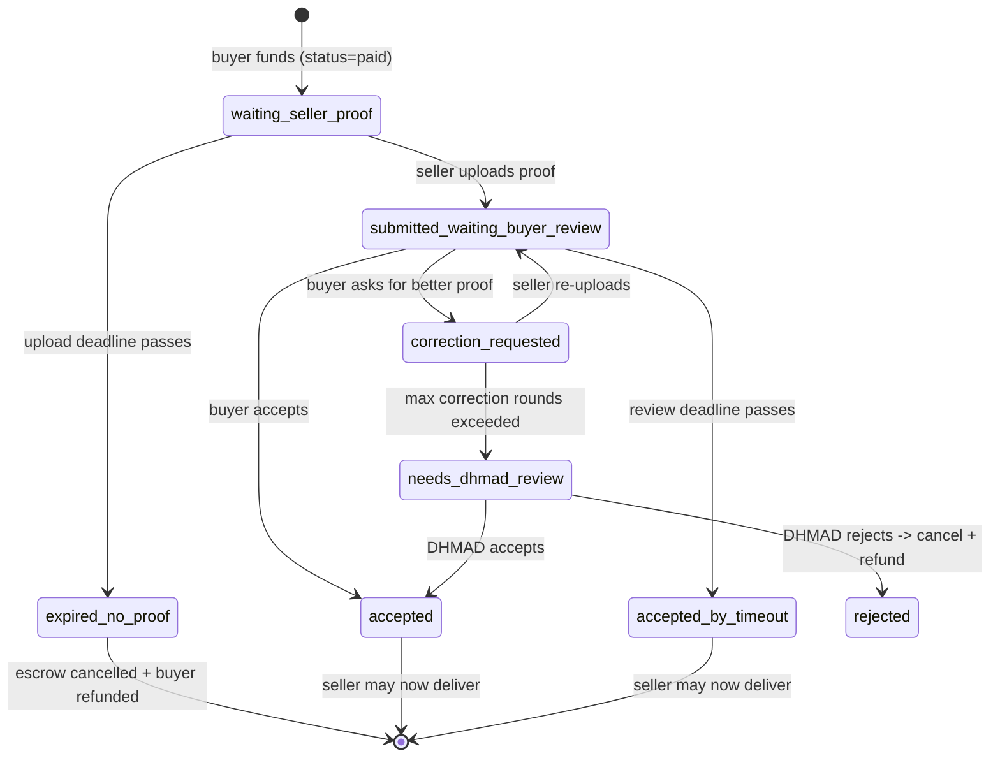

Use **Quick Escrow with Proof** when a buyer pays upfront but the seller must prove they purchased or shipped the item before delivery is unlocked — common for marketplaces, crowd-shipping, and product-deal apps.

## What is fulfillmentPolicy?

`fulfillmentPolicy` is an optional object on **create escrow** (`POST /api/v1/escrows`). It is only valid when `mode` is `"quick"`. Set:

```json
"fulfillmentPolicy": {
  "type": "purchase_proof_required",
  "proofUploadDeadlineHours": 24,
  "buyerReviewDeadlineHours": 24,
  "allowedProofTypes": ["receipt", "tracking_proof", "product_photo"]
}
```

| Field | Description |
| ----- | ----------- |
| `type` | Must be `purchase_proof_required` to enable the proof gate. |
| `proofUploadDeadlineHours` | Hours for the seller to upload after funding (must be within platform bounds, default 6–72h; **400** if out of range; 24h if omitted). |
| `buyerReviewDeadlineHours` | Hours for the buyer to review (same bounds; auto-accept if they do nothing). |
| `allowedProofTypes` | Optional **UI hints** for your app (`receipt`, `order_confirmation`, `product_photo`, `tracking_proof`, `other`). DHMAD does not reject uploads based on this list. |

While proof is in progress, escrow **`status` stays `paid`**. Track the proof lifecycle with **`proofInfo.phase`** and proof webhooks — not with status changes.

<Info>
  In the [API Explorer](https://developer.dhmad.tn/dashboard/api-explorer), expand **POST /v1/escrows**, click **Try it out**, and select the **Quick mode with purchase proof** request example.
</Info>

## Proof lifecycle



After `accepted` or `accepted_by_timeout`, the escrow continues through the normal **paid → delivered → completed** flow. The seller's deliver call returns **409** (`PROOF_NOT_ACCEPTED`) until proof is accepted.

## Step-by-step integration

### 1. Create the escrow (server-side)

Never expose your API key in the browser.

```javascript
const res = await fetch("https://sandbox.dhmad.tn/api/v1/escrows", {
  method: "POST",
  headers: {
    Authorization: `Bearer ${process.env.DHMAD_API_KEY}`,
    "Content-Type": "application/json",
  },
  body: JSON.stringify({
    title: "iPhone 15 from Dubai",
    amount: 2500,
    currency: "TND",
    buyerEmail: "buyer@example.com",
    sellerEmail: "traveler@example.com",
    estimatedDeliveryDays: 5,
    mode: "quick",
    fulfillmentPolicy: {
      type: "purchase_proof_required",
      proofUploadDeadlineHours: 24,
      buyerReviewDeadlineHours: 24,
    },
  }),
});
const { escrow } = await res.json();
```

See [Create Escrow](/api-reference/escrows/create-escrow) for all fields.

### 2. Buyer funds the escrow

Redirect the buyer with an `accept_pay` [checkout session](/guides/checkout-sessions). Once funded, `proofInfo.phase` becomes `waiting_seller_proof` and you receive `escrow.proof.required`.

### 3. Seller uploads proof

Create a checkout session with `action: "submit_proof"` and redirect the seller:

```javascript
const { url } = await (
  await fetch(`https://sandbox.dhmad.tn/api/v1/escrows/${escrowId}/sessions`, {
    method: "POST",
    headers: {
      Authorization: `Bearer ${process.env.DHMAD_API_KEY}`,
      "Content-Type": "application/json",
    },
    body: JSON.stringify({
      action: "submit_proof",
      targetUserEmail: "traveler@example.com",
      redirectUrl: "https://myapp.com/orders/123/proof-done",
    }),
  })
).json();
// redirect seller to url
```

On submit, phase becomes `submitted_waiting_buyer_review` and you receive `escrow.proof.submitted`.

### 4. Buyer reviews proof

Create a `review_proof` session for the buyer:

```javascript
await fetch(`https://sandbox.dhmad.tn/api/v1/escrows/${escrowId}/sessions`, {
  method: "POST",
  headers: {
    Authorization: `Bearer ${process.env.DHMAD_API_KEY}`,
    "Content-Type": "application/json",
  },
  body: JSON.stringify({
    action: "review_proof",
    targetUserEmail: "buyer@example.com",
    redirectUrl: "https://myapp.com/orders/123/review-done",
  }),
});
```

The buyer can **accept** or **request corrections**. After max correction rounds, DHMAD reviews (`escrow.proof.needs_review`). If the buyer does nothing before the deadline, proof is auto-accepted (`escrow.proof.accepted_by_timeout`).

### 5. Show proof on your site

Call **[GET /api/v1/escrows/:id/proof](/api-reference/escrows/get-escrow-proof)** to fetch proof metadata and **time-limited `viewUrl` links** you can embed in your UI. Raw storage keys are never returned.

Proof **webhooks** also include `viewUrl` on each attachment, plus `checkoutActions` suggesting the next checkout session to create.

```json
{
  "phase": "submitted_waiting_buyer_review",
  "latestSubmission": {
    "submittedAt": "2026-06-19T14:00:00.000Z",
    "attachments": [
      { "mimeType": "image/jpeg", "viewUrl": "https://cdn.dhmad.tn/..." }
    ]
  },
  "checkoutActions": [
    {
      "action": "review_proof",
      "targetUserEmail": "buyer@example.com",
      "description": "Create a checkout session..."
    }
  ]
}
```

### 6. Handle proof webhooks

Subscribe to proof events in the Developer Dashboard (or handle them in your webhook handler):

| Event | When |
| ----- | ---- |
| `escrow.proof.required` | Buyer funded; seller must upload |
| `escrow.proof.submitted` | Seller uploaded; buyer should review |
| `escrow.proof.correction_requested` | Buyer wants better proof |
| `escrow.proof.accepted` | Buyer accepted; delivery unlocked |
| `escrow.proof.accepted_by_timeout` | Review deadline passed; delivery unlocked |
| `escrow.proof.needs_review` | Escalated to DHMAD |
| `escrow.proof.expired` | No proof in time; cancelled + refunded |

See [Webhooks](/guides/webhooks#quick-escrow-with-proof-events) for payload details.

## Tips

- Use sandbox keys and `sandbox.dhmad.tn` for development.
- Prefer webhooks for state; use `GET /proof` when you need to render attachments.
- Accepting proof **unlocks delivery** — it does not certify goods; disputes remain available.
- `GET /api/v1/escrows/:id` returns `fulfillmentPolicy` and sanitized `proofInfo` (phase, deadlines) but not file URLs — use `GET /proof` or webhooks for `viewUrl`.
